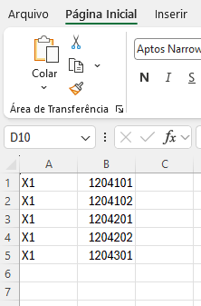
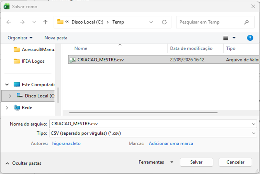
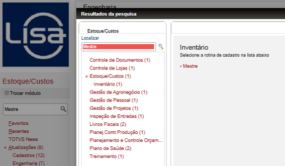
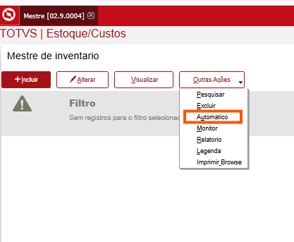
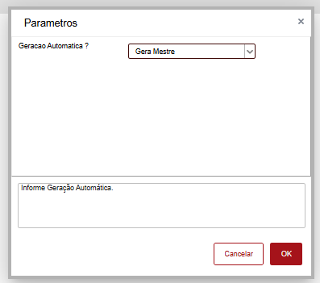
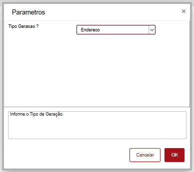
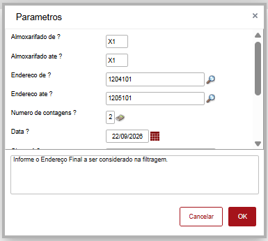
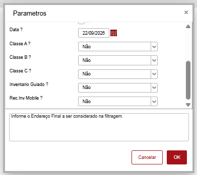
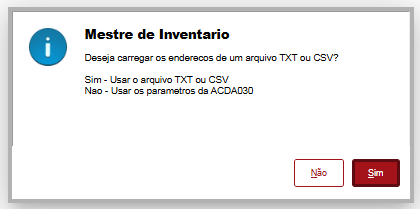
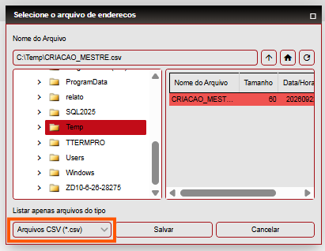

# Criação de Mestre por Arquivo

1. Gerando arquivo para criação dos mestres
Abra uma planilha no Excel.
Digite:
Na primeira coluna: o armazém.
Na segunda coluna: os endereços.

Salve o arquivo do Excel como .CSV em alguma pasta do computador, por exemplo, C:\.

2. Acessando a rotina
Pesquise por:

Mestre > Estoque/Custos > Inventário > Mestre

3. Criando os mestres
Acesse:

Outras Ações > Automático > Gera Mestre > Endereço

Parâmetros
Na tela de geração automática:

Geração Automática: selecione a opção correspondente.
Gera Mestre: selecione Endereço.

Informe os parâmetros necessários.

Ponto de atenção: os endereços presentes no arquivo CSV precisam estar dentro da cadeia informada nos parâmetros Endereço de? e Endereço até?.

4. Processando o arquivo CSV
Clique em Sim. 

Altere a busca para o tipo criado, CSV.
Selecione o arquivo CSV.
Clique em Salvar.

5. Resultado do processamento
Ao final do processamento, será exibida uma mensagem informando:

Os endereços encontrados.
Os endereços criados com sucesso.
