# Conferência de embarque

## 1. Objetivo

Realizar a confência dos produtos embarcados do veículo no momento da expedição e enviar solicitação de faturamento com produtos conferidos e embarcados.

---

## 2. Configuração

| Campo | Conteúdo | Descrição |
|---|---|---|
| `ZCI_MAILFT` | E-mails | Destinatário de e-mail para recebimento da solicitação de faturamento (separar e-mails por um ponto e vírgula) |

---

# 3. Processo de conferência

### Fluxo

```text
Informa pedido
      ↓
Bipa produto
      ↓
Registra item embarcado
      ↓
Fecha o embarque
      ↓
Existem sobras?
   ↙          ↘
 Sim           Não
  ↓             ↓
Exibe sobras    ↓
  ↓             ↓
Solicita confirmação
      ↓
Confirma fechamento
      ↓
Envia e-mail para faturamento
```

Acesse a rotina **Conf Recebimento** para iniciar a conferência do pedido:

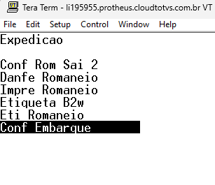

Informe o número do pedido:

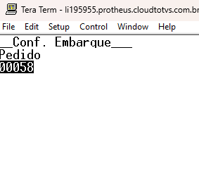

Informar o código de barras do produto a ser conferido:

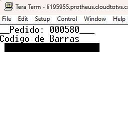

Para consultar os produtos já conferidos pressione `Ctrl + Q`

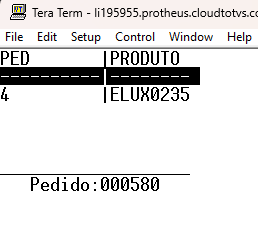

Após realizar a conferência de todos os produtos precione `Esc` para sair ou fechar a conferência:

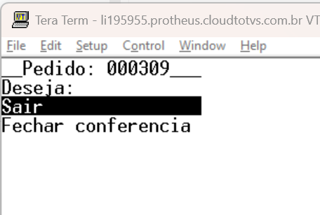

#### Registros de conferência do embarque

Acessar a opção `Conferencia Embarquei` no Protheus WMS:

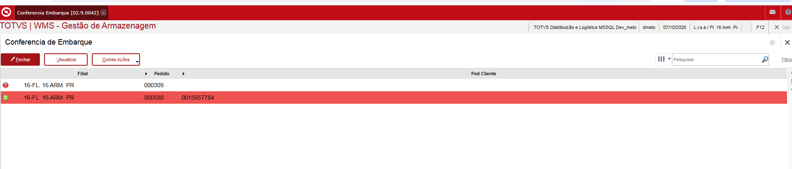

Acione a opcão visualisar para ter acesso ao registros de conferência.

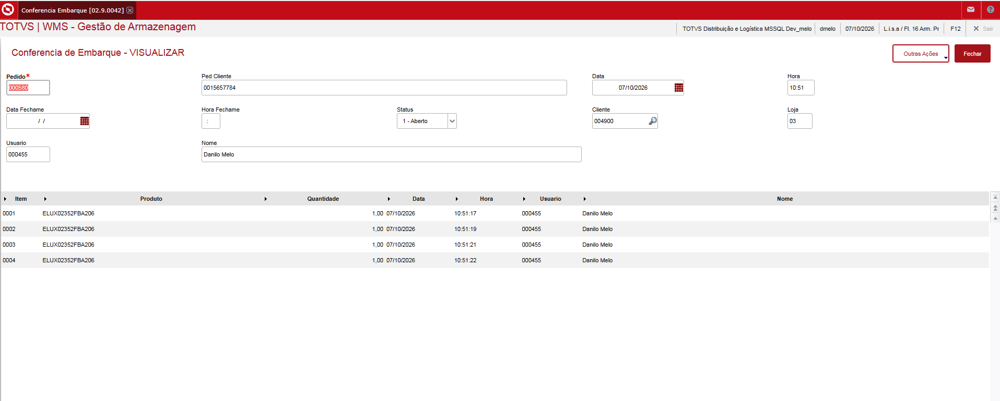

Acione a opcão em outras ações monitor verificar a relação de produtos conferidos e produtos no pedido de venda.

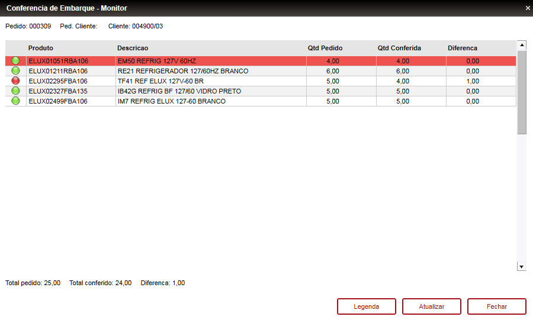

> ATENÇÃO → Precionando a tecla de atalho F12 a tela de monitor será apresentada para o pedido posicionado.

Para fechar a conferência de embarque do pedido acione a opção `fechar`.


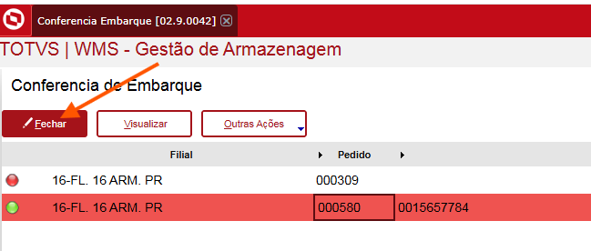

Para solicitar o faturamento do pedido e enviar o e-mail acione a opção `Solicitar faturamento`

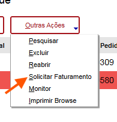

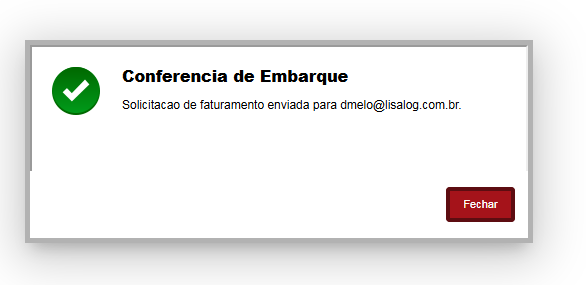

Caso necessário é possível reabrir uma conferência de um pedido através da opção `Reabrir`

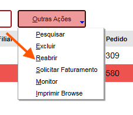

Modelo de e-mail enviado quando há sobras de embarque.

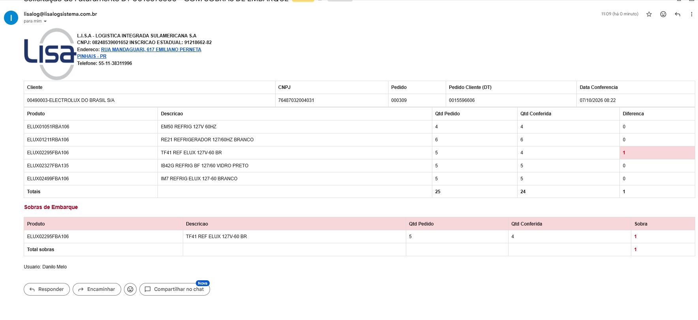

Modelo de e-mail enviado quando não há sobras de embarque.

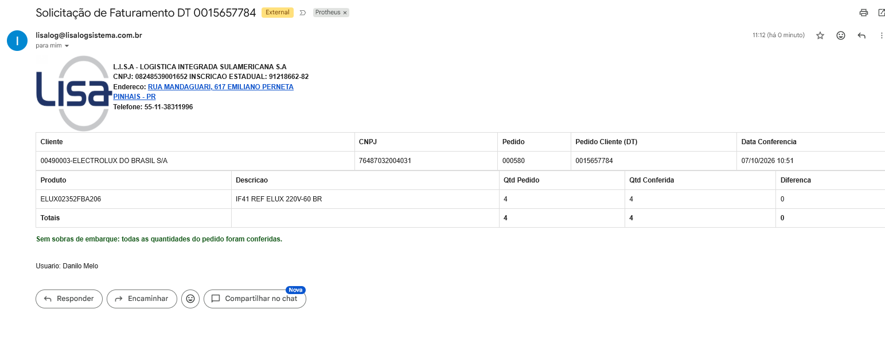

---

# 4. Informações adicionais

- Apenas pedidos no status `CONFERIDO` podem iniciar a conferência de embarque.
- E-mail de solicitação do fatumento só é enviado para conferência `Fechada`.
- Após o envio com sucesso do e-mail de solicitação de faturamento o campo `Enviado (ZAO_ENVIA)` é marcado como `S` identificando que já foi enviado e-mail do pedido.